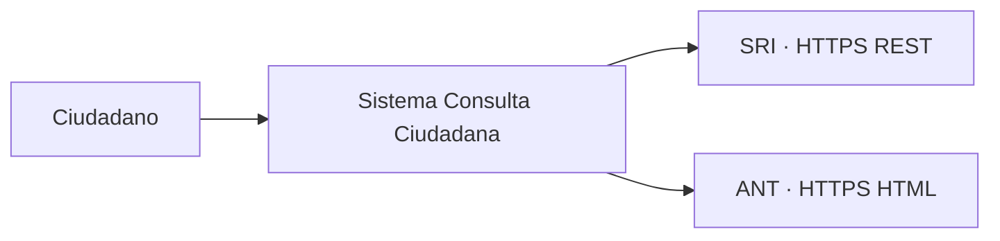
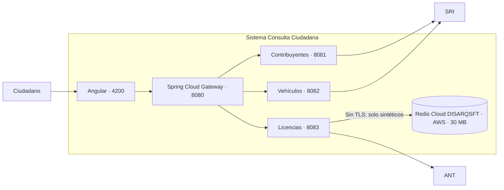
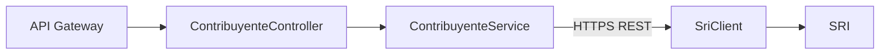
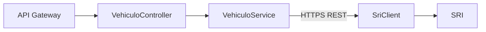
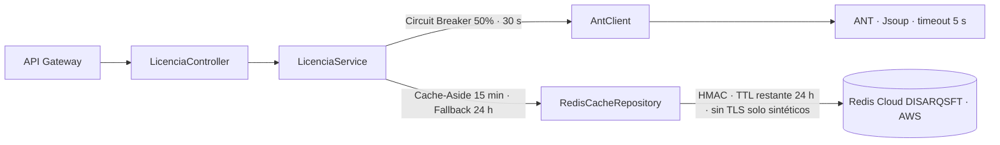

## C1-contexto

```mermaid
flowchart LR
 ciudadano[Ciudadano] --> sistema[Sistema Consulta Ciudadana]
 sistema --> sri[SRI · HTTPS REST]
 sistema --> ant[ANT · HTTPS HTML]
```

## C2-contenedores

```mermaid
flowchart LR
 ciudadano[Ciudadano] --> frontend[Angular · 4200]
 subgraph consulta[Sistema Consulta Ciudadana]
 frontend --> gateway[Spring Cloud Gateway · 8080]
 gateway --> contribuyentes[Contribuyentes · 8081]
 gateway --> vehiculos[Vehículos · 8082]
 gateway --> licencias[Licencias · 8083]
 licencias -->|Sin TLS: solo sintéticos| redis[(Redis Cloud DISARQSFT · AWS · 30 MB)]
 end
 contribuyentes --> sri[SRI]
 vehiculos --> sri
 licencias --> ant[ANT]
```

## C3-contribuyentes

```mermaid
flowchart LR
 gateway[API Gateway] --> controller[ContribuyenteController]
 controller --> service[ContribuyenteService]
 service -->|HTTPS REST| client[SriClient]
 client --> external[SRI]
```

## C3-vehiculos

```mermaid
flowchart LR
 gateway[API Gateway] --> controller[VehiculoController]
 controller --> service[VehiculoService]
 service -->|HTTPS REST| client[SriClient]
 client --> external[SRI]
```

## C3-licencias

```mermaid
flowchart LR
 gateway[API Gateway] --> controller[LicenciaController]
 controller --> service[LicenciaService]
 service -->|Circuit Breaker 50% · 30 s| client[AntClient]
 client --> external[ANT · Jsoup · timeout 5 s]
 service -->|Cache-Aside 15 min · Fallback 24 h| cache[RedisCacheRepository]
 cache -->|HMAC · TTL restante 24 h · sin TLS solo sintéticos| redis[(Redis Cloud DISARQSFT · AWS)]
```
